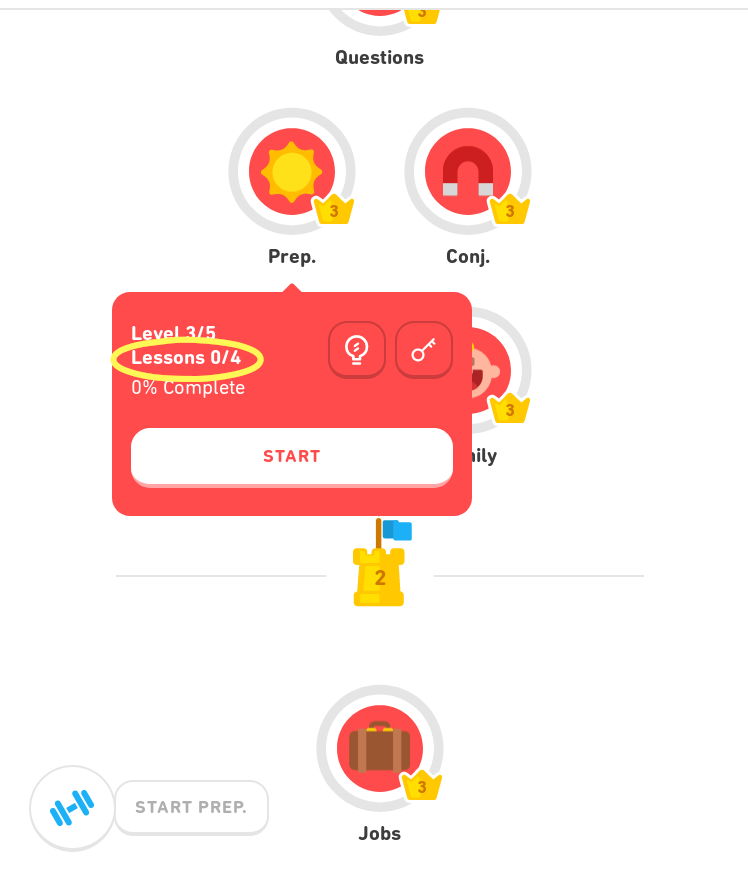
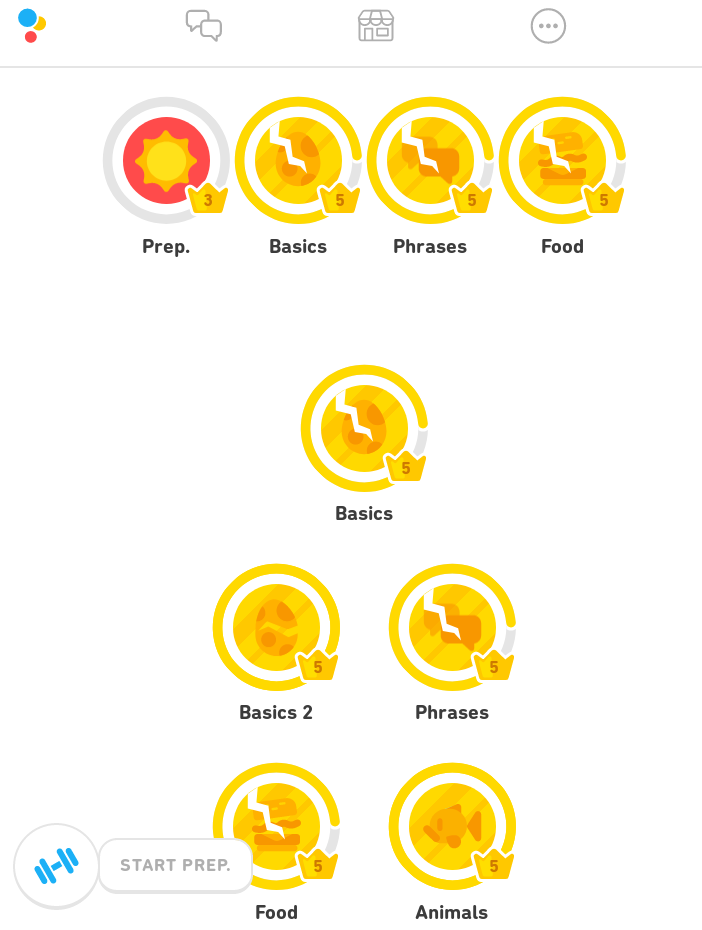
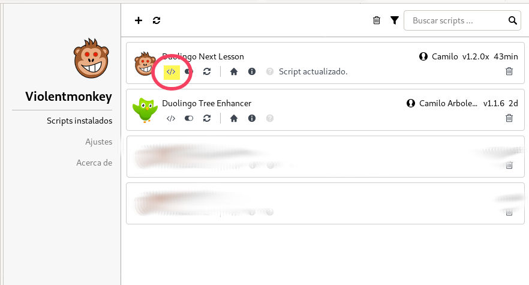
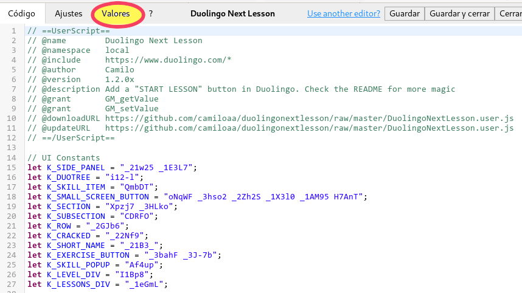
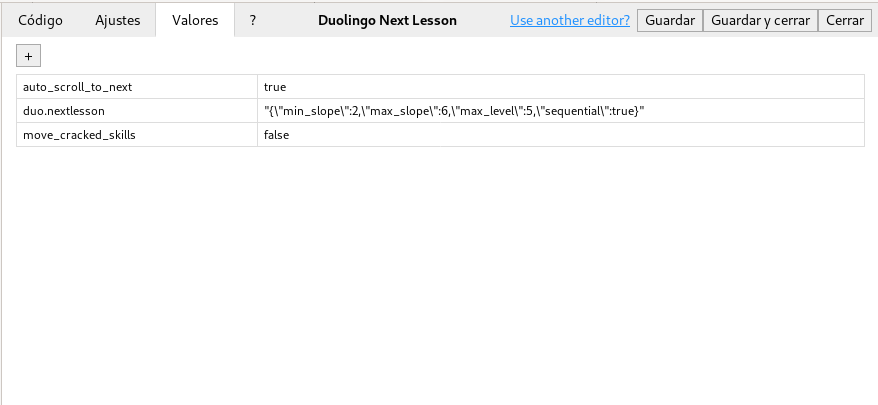

DuolingoNextLesson
===========

If you have Tampermonkey/Greasemonkey/Violentmonkey installed you can [install the script by clicking on this link](https://github.com/camiloaa/duolingonextlesson/raw/master/DuolingoNextLesson.user.js)

## Features

- Recommend next lesson to study following a staircase order. Earlier lessons will reach level 5 before later lessons.
- Add a floating button with the recommended skill.
- Create a new section on top of the tree with all the cracked skills.
- Show number of lessons in each skill in addition to percentages.
- Per-course configuration. Not user friendly!

## Screenshots

Recommended lesson showing number of lessons and floating button    


Top of the tree    


## Configure

You can adjust the script behavior in different ways.
There is no GUI for changing the script behavior, but it is not rocket science either.
Instructions are for ViolentMonkey, but other script managers have similar functionality.

1. Open the script manager and select the "edit script icon"    


2. Select the "values" tab    


3. Select the + icon to add new configuration options    


### Overwrite auto-scroll behavior

If you don't like your duolingo tree auto-scrolling to the recommended lesson, you can
disable the feature adding a new key 'auto_scroll_to_next' with value 'false'.

You can also set the value to 'true' if you want it to always scroll to the
recommended skill, independetly of cracked skills or not.

### Move recommended skills to the top

By default, the skills on the top of the tree are just pointers to the "actual" skills.
When you click them, you just jump to the place on the tree where the skill is usually located.

You can change that behavior by "moving" them to the top, meaning that the original skills won't show
in their original position anymore, but only in the new section at the top.

To achieve it, add a new key 'move_cracked_skills' with value 'true'.

### Different defaults

The algorithm for recommending a lesson is weighted by default in a way that the first skill of the
tree will reach level 5 more or less when you are 1/3 into the tree.

That's it, if you add the next key/value pair, nothing will change.


```
key: duo.nextlesson
value:  "{\"min_slope\":2.0,\"max_slope\":6.0,\"max_level\":5.0,\"sequential\":true}"
```

By changing the min_slope and max_slope values, you can decide how much emphasis you want to put
on repetition vs new lessons.

A slope of 1 means that you will reach level 5 in the first lesson, at the same time you are
finishing the last lesson of the tree. A slope of 2 means that you will reach level 5 for the
first lesson when you are around 1/2 of the tree. A slope of 5 will do it at 1/5th and so on.
Slope has to be a positive number, but it doesn't have to be an integer.

A low value will mean you get more new lessons, and probably a mostly blue tree at the end.

A high value will mean you reach level 5 faster, at the expense of new lessons.

The difference between min_slope and max_slope will dictate the degree of flexibility for the policy.
If you decide to ignore the recommendations, and study new lessons instead, a lower value in min_slope
will allow the script to adapt to your actual pace of study.

### Per-course configuration

Use a key called 'duo.nextlesson.target.from'. For example, if you are learning Spanish
from English use

```
duo.nextlesson.es.en
```
